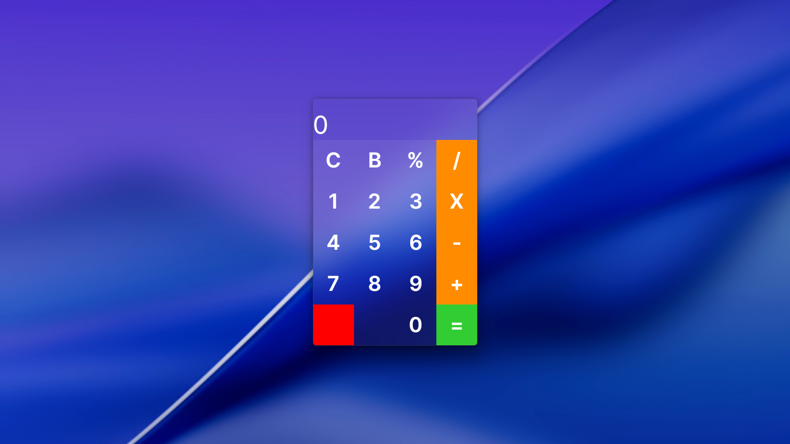

<h1>
  
  Modern Calculator App
</h1>

A simple, modern calculator built with **C#** and **Avalonia UI**.

<p align="center">
  
</p>


It shows how to design a clean, responsive desktop interface using Avalonia’s cross-platform tools and layout system.

### ✨ Overview

This project demonstrates how to:

* Build a lightweight calculator with Avalonia UI.
* Apply **Liquid Glass** design elements—layered transparency, subtle depth, and smooth gradients.
* Structure a small desktop app with maintainable, beginner-friendly C# code.

While it supports only four basic operations (addition, subtraction, multiplication, and division), the focus is on visual refinement and code clarity. The goal is to help developers understand how to translate modern design trends like glassmorphism into real-world desktop implementations.

### 🧠 Who It’s For

UI developers with about one year of experience building online projects who want to:

* Explore Avalonia UI’s component model.
* Learn how to combine functional precision with visual polish.
* Experiment with modern interface effects on desktop applications.

### ⚙️ Features

* Cross-platform desktop support (Windows, macOS, Linux)
* Four core operations: `+`, `−`, `×`, `÷`
* Minimal, layered glass-style UI
* Clear project structure for easy extension

### 🚀 How to Use

1. Clone the repository:

   ```bash
   git clone https://github.com/erdewave/modern-calculator-app.git
   cd modern-calculator-app
   ```
2. Build and run the app:

   ```bash
   dotnet run
   ```
3. Perform basic operations directly in the interface.

### 🧩 Tech Stack

* **Language:** C#
* **Framework:** Avalonia UI
* **Design Style:** Liquid Glass (Glassmorphism)

### 📚 Learning Value

This project can serve as a visual and structural reference for developers interested in:

* Implementing translucent UI effects efficiently.
* Building maintainable Avalonia-based applications.
* Adapting modern design trends for desktop interfaces.

---
